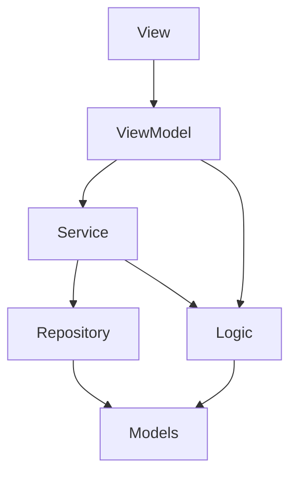
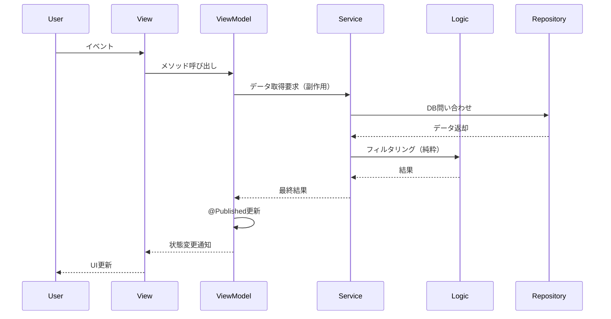

# ADR-001: フォルダ構成とアーキテクチャの再設計

**ステータス**: 採用

**日付**: 2025-10-24

## 背景と課題

### 何が問題だったか

現在のフォルダ構成には以下の課題がある：

1. **コロケーションされていない**
   - ViewとViewModelが別フォルダに分離
   - 機能を理解するために複数のフォルダを行き来する必要がある

2. **責務が不明確**
   - Presentation/Map/にServiceが混在
   - Share/の役割が不明確
   - Support/が雑多で何でも入れる場所になっている

3. **純粋な関数とServiceが混在**
   - ビジネスロジック（純粋な関数）と副作用のある処理（Service）が区別されていない
   - テスト可能性と再利用性が低い

4. **ScreenとViewの区別が不明確**
   - 命名が統一されていない（HomeView、VisitDetailScreen）
   - エントリポイントがどこか分かりにくい

### 制約

- 小規模チーム（数人）での開発
- 既存コードからの段階的な移行が必要
- 過度な複雑性は避ける（Screenレイヤーは導入しない）

## 検討した選択肢

### 選択肢1: 機能ベース（Feature-based）

- **概要**: Home/、Create/などで全てをまとめる
- **メリット**: 関連ファイルが近く、開発しやすい
- **デメリット**: 層の境界が曖昧になりがち

### 選択肢2: レイヤーベース（Layer-based）

- **概要**: Domain/、Infrastructure/、Presentation/で分ける
- **メリット**: アーキテクチャが明確
- **デメリット**: 機能追加時に複数フォルダを触る必要がある

### 選択肢3: コンポーネントベース（採用）

- **概要**: ロジックは機能ベースでパーツ化し、UI層で組み上げる
- **メリット**:
  - ロジックが再利用可能なパーツになる
  - UIは複数のロジックを組み合わせる
  - 中程度のコロケーション
- **デメリット**: フォルダ階層がやや深くなる

## 決定

### 採用する選択肢

**選択肢3: コンポーネントベース型**

ロジックは機能単位でパーツ化し、UI層で組み立てる構成。

### なぜこれを選んだか

1. **「ロジックは機能ベースでパーツを作成し、UI層で組み上げる」という開発方針に合致**
2. **コロケーション中程度**: ViewとViewModelは同じフォルダ、共通ロジックはDomain/
3. **純粋な関数とServiceを明確に分離**できる
4. **再利用性が高い**: ロジックパーツを複数の画面で使い回せる
5. **段階的な移行が可能**: 既存コードから少しずつ移行できる

### 実装方針

#### 新しいフォルダ構成

```
kokokita/
├── Domain/                        # ビジネスロジック層
│   ├── Models/                   # データ構造
│   │   ├── Visit.swift
│   │   ├── Taxonomy.swift
│   │   └── Location.swift
│   │
│   ├── Logic/                    # 純粋な関数（副作用なし）
│   │   ├── Calculations/         # 計算ロジック
│   │   │   ├── DistanceCalculator.swift
│   │   │   └── CoordinateValidator.swift
│   │   ├── Formatting/           # フォーマット
│   │   │   ├── DateFormatter.swift
│   │   │   └── AddressFormatter.swift
│   │   ├── Validation/           # バリデーション
│   │   │   └── InputValidator.swift
│   │   └── Filtering/            # フィルタリング
│   │       └── VisitFilter.swift
│   │
│   ├── Services/                 # 副作用のある処理
│   │   ├── Location/
│   │   │   ├── LocationService.swift
│   │   │   └── LocationGeocodingService.swift
│   │   ├── POI/
│   │   │   ├── POIService.swift
│   │   │   └── POICoordinatorService.swift
│   │   ├── Photo/
│   │   │   ├── PhotoEditService.swift
│   │   │   └── ImageStore.swift
│   │   └── Visit/
│   │       ├── VisitRepository.swift
│   │       └── TaxonomyRepository.swift
│   │
│   └── Protocols/                # インターフェース定義
│       ├── RepositoryProtocols.swift
│       └── ServiceProtocols.swift
│
├── Infrastructure/               # 技術的実装
│   ├── CoreData/
│   │   ├── CoreDataStack.swift
│   │   ├── CoreDataVisitRepository.swift
│   │   └── CoreDataTaxonomyRepository.swift
│   └── Security/
│       └── DefaultIntegrityService.swift
│
├── Screens/                      # 画面単位（UI層）
│   ├── Home/
│   │   ├── HomeViewModel.swift   # 状態管理 + Service結合
│   │   ├── HomeView.swift        # 表示（エントリポイント）
│   │   └── Components/           # この画面専用のコンポーネント
│   │       ├── VisitRow.swift
│   │       └── FilterSheet.swift
│   │
│   ├── Create/
│   │   ├── CreateEditViewModel.swift
│   │   ├── CreateView.swift
│   │   └── Components/
│   │       ├── LocationSection.swift
│   │       ├── POISection.swift
│   │       └── PhotoSection.swift
│   │
│   ├── Detail/
│   │   ├── DetailViewModel.swift
│   │   ├── DetailView.swift
│   │   └── Components/
│   │       └── PhotoGrid.swift
│   │
│   └── Menu/
│       ├── MenuViewModel.swift
│       ├── MenuView.swift
│       └── Components/
│
├── UIComponents/                 # 共通UIコンポーネント
│   ├── Buttons/
│   │   └── BigFooterButton.swift
│   ├── Forms/
│   │   ├── LabelPicker.swift
│   │   └── GroupPicker.swift
│   ├── Media/
│   │   ├── PhotoPager.swift
│   │   └── PhotoThumb.swift
│   └── Navigation/
│       └── RootTabView.swift
│
├── App/                          # アプリケーション設定
│   ├── AppDelegate.swift
│   ├── KokokitaApp.swift
│   ├── Config/
│   │   ├── AppConfig.swift
│   │   └── UIConstants.swift
│   └── DI/
│       └── DependencyContainer.swift
│
├── Resources/                    # リソース
│   └── Localization/
│       ├── LocalizedString.swift
│       ├── ja.lproj/
│       └── en.lproj/
│
└── Utilities/                    # 汎用ユーティリティ
    ├── Extensions/
    │   ├── Date+Extensions.swift
    │   ├── String+Extensions.swift
    │   └── Collection+Extensions.swift
    ├── Helpers/
    │   ├── Logger.swift
    │   ├── KeyboardHelpers.swift
    │   └── NavigationRouter.swift
    └── Protocols/
        └── MKPointOfInterestCategory+JP.swift
```

#### 各層の責務

| 層 | 責務 | 状態 | 副作用 |
|----|------|------|--------|
| **Logic** | 純粋な関数（計算、フォーマット、バリデーション） | なし | なし |
| **Service** | 副作用のある処理（API、DB、位置情報、I/O） | なし | あり |
| **ViewModel** | 状態管理、Serviceとの結合 | あり | なし（Serviceに委譲） |
| **View** | 表示、ユーザーイベント受付 | なし | なし |

#### 命名規則

- **View**: `[機能名]View.swift`（例：HomeView.swift）
- **ViewModel**: `[機能名]ViewModel.swift`（例：HomeViewModel.swift）
- **Service**: `[機能名]Service.swift`（例：LocationService.swift）
- **Logic**: `[処理名].swift`（例：DistanceCalculator.swift）
- **エントリポイント**: View（Screenレイヤーは導入しない）

#### 純粋な関数とServiceの区別

**純粋な関数（Domain/Logic/）**:
```swift
// ✅ 副作用なし、同じ入力 → 同じ出力
struct VisitFilter {
    static func filterByDateRange(visits: [Visit], from: Date, to: Date) -> [Visit] {
        visits.filter { $0.timestamp >= from && $0.timestamp <= to }
    }
}
```

**Service（Domain/Services/）**:
```swift
// ✅ 副作用あり（DB、API、位置情報など）
class VisitService {
    func fetchVisits() throws -> [Visit] {
        try repository.fetchAll()  // DB操作 = 副作用
    }
}
```

## 影響

### プラス面

1. **コードの見通しが良くなる**
   - 機能単位でファイルがまとまる
   - ViewとViewModelが同じフォルダ

2. **再利用性の向上**
   - 純粋な関数は複数の場所で使い回せる
   - Serviceも独立しているため再利用しやすい

3. **テスト可能性の向上**
   - 純粋な関数は簡単にテストできる
   - Serviceもモック化しやすい

4. **開発効率の向上**
   - 機能追加時に1つのフォルダ内で完結しやすい
   - 関連ファイルを探しやすい

### マイナス面と対策

1. **移行コストがかかる**
   - 対策: 段階的に移行。新規機能から新構成を適用

2. **フォルダ階層が深くなる**
   - 対策: 3階層程度に抑える。過度な細分化は避ける

3. **どこに配置するか迷う場合がある**
   - 対策: implementation-guide.mdに判断基準を明記

### 影響を受けるコンポーネント

- **全体**: フォルダ構成が大きく変わる
- **Infrastructure**: ほぼそのまま（CoreData関連）
- **Presentation**: Screens/に再編成
- **Services**: Domain/Services/に移動
- **Support**: Utilities/に名称変更、整理

## 技術詳細

### 依存の方向



### データフロー



## 移行計画

### Phase 1: ドキュメント整備（完了）
- [x] ADR作成
- [ ] best-practices.md更新
- [ ] implementation-guide.md更新

### Phase 2: フォルダ構造準備
1. 新しいフォルダを作成
2. 移行対象ファイルをリストアップ

### Phase 3: 段階的な移行
1. **優先度高**: Services/の整理
2. **優先度中**: Presentation/をScreens/に移行
3. **優先度低**: Utilities/の整理

### Phase 4: 既存コードのリファクタリング
- 純粋な関数をLogic/に切り出し
- Serviceから純粋なロジックを分離

## 参考資料

- Clean Architecture (Robert C. Martin)
- SwiftUIのベストプラクティス
- 既存のCLAUDE.md、best-practices.md

## メモ

- Screenレイヤーは複雑性を抑えるため導入しない
- Viewがエントリポイントとして機能
- 小規模チームでの運用を重視し、過度な抽象化は避ける
