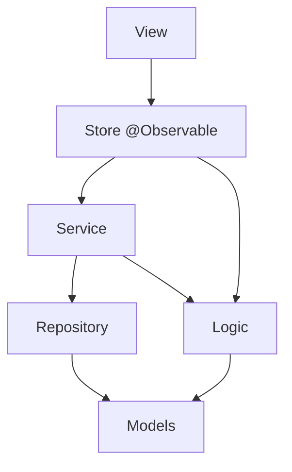
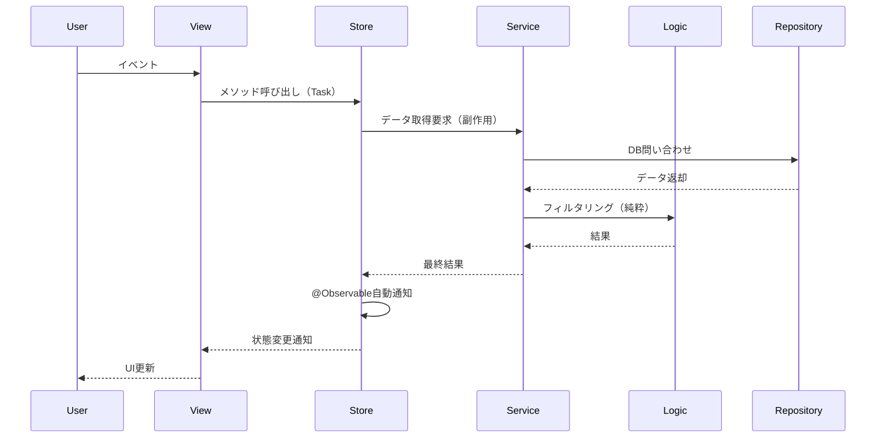

# ADR-001: フォルダ構成とアーキテクチャの再設計

**ステータス**: 採用

**日付**: 2025-10-24

## 背景と課題

### 何が問題だったか

現在のフォルダ構成には以下の課題がある：

1. **コロケーションされていない**
   - ViewとViewModelが別フォルダに分離
   - 機能を理解するために複数のフォルダを行き来する必要がある

2. **責務が不明確**
   - Presentation/Map/にServiceが混在
   - Shared/の役割が不明確（Share/から統合）
   - Support/が雑多で何でも入れる場所になっている

3. **純粋な関数とServiceが混在**
   - ビジネスロジック（純粋な関数）と副作用のある処理（Service）が区別されていない
   - テスト可能性と再利用性が低い

4. **MVVMパターンの複雑性**
   - ViewModelが状態管理とロジックの橋渡しの両方を担い、責務が曖昧
   - iOS 17+の@Observableマクロを活用できていない

### 制約

- 小規模チーム（数人）での開発
- 既存コードからの段階的な移行が必要
- 過度な複雑性は避ける
- iOS 17+をターゲットとする

### 最新のSwiftベストプラクティス（2025年）

調査の結果、以下のトレンドが確認された：

1. **MVVM → MV への移行**
   - @Observableマクロ（iOS 17+）により、ViewModelを排除してシンプルなStoreで状態管理
   - ObservableObjectやCombineのボイラープレートが不要に

2. **Feature-based モジュラーアーキテクチャ**
   - 機能単位でファイルをまとめる
   - 各機能が独立したモジュールとして機能
   - コロケーションを最優先

3. **The Composable Architecture (TCA)**
   - 人気だが小規模プロジェクトには過剰
   - 本プロジェクトの規模には不適切

## 検討した選択肢

### 選択肢1: Component-based（MVVM）

- **概要**: Domain/とScreens/で分け、ViewとViewModelをコロケーション
- **メリット**: Clean Architectureの原則に忠実
- **デメリット**:
  - ViewModelレイヤーが余分な複雑性を生む
  - 2025年のSwiftベストプラクティスに合致しない

### 選択肢2: Layer-based（レイヤーベース）

- **概要**: Domain/、Infrastructure/、Presentation/で厳密に分ける
- **メリット**: アーキテクチャが明確
- **デメリット**:
  - コロケーションが最悪
  - 機能追加時に複数フォルダを触る必要がある

### 選択肢3: Feature-based MV（採用）

- **概要**: 機能単位でフォルダを作り、その中にModels/Logic/Services/Views/を配置
- **メリット**:
  - **コロケーション最優先**: 関連ファイルが全て近くにある
  - **2025年のベストプラクティスに合致**: @Observableを活用したMVパターン
  - **シンプル**: ViewModelレイヤーを排除し、Storeで状態管理
  - **モジュール化**: 各機能が独立し、SPMで分離も可能
  - **テスト容易**: 純粋な関数とServiceが明確に分離
- **デメリット**:
  - フォルダ階層がやや深くなる（ただし3階層程度）

## 決定

### 採用する選択肢

**選択肢3: Feature-based MV**

機能単位でフォルダを作成し、@Observableを使ったStoreで状態管理を行う構成。

### なぜこれを選んだか

1. **2025年のSwiftベストプラクティスに合致**
   - @Observableマクロを活用
   - MVパターンでシンプルに保つ
   - Feature-basedモジュラーアーキテクチャ

2. **最高のコロケーション**
   - 機能に関連する全てのファイルが1つのフォルダにまとまる
   - 開発効率が大幅に向上

3. **純粋な関数とServiceを明確に分離**
   - Logic/: 副作用なしの純粋な関数
   - Services/: 副作用のある処理（DB、API、位置情報等）

4. **段階的な移行が可能**
   - 既存コードから少しずつ移行できる
   - 新機能から新構成を適用可能

5. **将来のモジュール化に対応**
   - Swift Package Managerで機能ごとに分離可能
   - 必要に応じてマイクロフロントエンド的な構成も可能

### 実装方針

#### 新しいフォルダ構成

```
kokokita/
├── Features/                      # 機能単位（Feature-based）
│   ├── Home/                      # ホーム画面機能
│   │   ├── Models/
│   │   │   └── HomeStore.swift   # @Observable（状態管理）
│   │   ├── Logic/
│   │   │   └── VisitFilter.swift # 純粋な関数
│   │   ├── Services/
│   │   │   └── VisitService.swift # 副作用（DB操作等）
│   │   └── Views/
│   │       ├── HomeView.swift    # エントリポイント
│   │       └── Components/       # この機能専用のコンポーネント
│   │           ├── VisitRow.swift
│   │           └── FilterSheet.swift
│   │
│   ├── Create/                    # 訪問作成機能
│   │   ├── Models/
│   │   │   └── CreateStore.swift
│   │   ├── Logic/
│   │   │   ├── CoordinateValidator.swift
│   │   │   └── AddressFormatter.swift
│   │   ├── Services/
│   │   │   ├── LocationService.swift
│   │   │   ├── POIService.swift
│   │   │   └── PhotoService.swift
│   │   └── Views/
│   │       ├── CreateView.swift
│   │       └── Components/
│   │           ├── LocationSection.swift
│   │           ├── POISection.swift
│   │           └── PhotoSection.swift
│   │
│   ├── Detail/                    # 訪問詳細機能
│   │   ├── Models/
│   │   │   └── DetailStore.swift
│   │   ├── Services/
│   │   │   └── DetailService.swift
│   │   └── Views/
│   │       ├── DetailView.swift
│   │       └── Components/
│   │           └── PhotoGrid.swift
│   │
│   └── Menu/                      # メニュー機能
│       ├── Models/
│       │   └── MenuStore.swift
│       └── Views/
│           └── MenuView.swift
│
├── Shared/                        # 複数機能で使用する共通コード
│   ├── Models/                    # 共通のドメインモデル
│   │   ├── Visit.swift
│   │   ├── Taxonomy.swift
│   │   ├── Location.swift
│   │   └── Member.swift
│   │
│   ├── Logic/                     # 共通の純粋な関数
│   │   ├── Calculations/
│   │   │   └── DistanceCalculator.swift
│   │   ├── Formatting/
│   │   │   └── DateFormatter.swift
│   │   └── Validation/
│   │       └── InputValidator.swift
│   │
│   ├── Services/                  # 共通のService
│   │   ├── Persistence/
│   │   │   ├── CoreDataStack.swift
│   │   │   ├── VisitRepository.swift
│   │   │   └── TaxonomyRepository.swift
│   │   └── Security/
│   │       └── IntegrityService.swift
│   │
│   └── UIComponents/              # 共通UIコンポーネント
│       ├── Buttons/
│       │   └── BigFooterButton.swift
│       ├── Forms/
│       │   ├── LabelPicker.swift
│       │   └── GroupPicker.swift
│       └── Media/
│           ├── PhotoPager.swift
│           └── PhotoThumb.swift
│
├── App/                           # アプリケーション設定
│   ├── KokokitaApp.swift
│   ├── AppDelegate.swift
│   ├── Config/
│   │   ├── AppConfig.swift
│   │   └── UIConstants.swift
│   └── DI/
│       └── DependencyContainer.swift
│
├── Resources/                     # リソース
│   └── Localization/
│       ├── LocalizedString.swift
│       ├── ja.lproj/
│       └── en.lproj/
│
└── Utilities/                     # 汎用ユーティリティ
    ├── Extensions/
    │   ├── Date+Extensions.swift
    │   ├── String+Extensions.swift
    │   └── Collection+Extensions.swift
    ├── Helpers/
    │   ├── Logger.swift
    │   ├── KeyboardHelpers.swift
    │   └── NavigationRouter.swift
    └── Protocols/
        └── MKPointOfInterestCategory+JP.swift
```

#### 各層の責務（MVパターン）

| 層 | 責務 | 状態 | 副作用 |
|----|------|------|--------|
| **Logic** | 純粋な関数（計算、フォーマット、バリデーション） | なし | なし |
| **Service** | 副作用のある処理（API、DB、位置情報、I/O） | なし | あり |
| **Store** | 状態管理、Serviceとの結合（@Observable） | あり | なし（Serviceに委譲） |
| **View** | 表示、ユーザーイベント受付 | @State（Storeへの参照のみ） | なし |

#### 命名規則

- **View**: `[機能名]View.swift`（例：HomeView.swift）
- **Store**: `[機能名]Store.swift`（例：HomeStore.swift）
- **Service**: `[機能名]Service.swift`（例：LocationService.swift）
- **Logic**: `[処理名].swift`（例：DistanceCalculator.swift）
- **エントリポイント**: View

#### コード例

**Store（@Observableで状態管理）**:
```swift
// Features/Home/Models/HomeStore.swift
import Foundation
import Observation

@Observable
final class HomeStore {
    // 状態
    var visits: [Visit] = []
    var isLoading = false
    var errorMessage: String?

    // 依存するService
    private let visitService: VisitService

    init(visitService: VisitService = .shared) {
        self.visitService = visitService
    }

    // アクション
    func load() async {
        isLoading = true
        errorMessage = nil

        do {
            // Serviceに副作用を委譲
            visits = try await visitService.fetchAll()
        } catch {
            errorMessage = error.localizedDescription
        }

        isLoading = false
    }

    func delete(_ visit: Visit) async {
        do {
            try await visitService.delete(visit)
            visits.removeAll { $0.id == visit.id }
        } catch {
            errorMessage = error.localizedDescription
        }
    }
}
```

**View（Storeを@Stateで保持）**:
```swift
// Features/Home/Views/HomeView.swift
import SwiftUI

struct HomeView: View {
    // Storeを@Stateで保持（iOS 17+の@Observableと連携）
    @State private var store = HomeStore()

    var body: some View {
        NavigationStack {
            Group {
                if store.isLoading {
                    ProgressView("読み込み中...")
                } else {
                    List(store.visits) { visit in
                        VisitRow(visit: visit)
                            .swipeActions {
                                Button(role: .destructive) {
                                    Task {
                                        await store.delete(visit)
                                    }
                                } label: {
                                    Label("削除", systemImage: "trash")
                                }
                            }
                    }
                }
            }
            .navigationTitle("訪問履歴")
            .task {
                await store.load()
            }
            .alert("エラー",
                   isPresented: .constant(store.errorMessage != nil),
                   presenting: store.errorMessage) { _ in
                Button("OK") {
                    store.errorMessage = nil
                }
            } message: { message in
                Text(message)
            }
        }
    }
}
```

**Service（副作用のある処理）**:
```swift
// Features/Home/Services/VisitService.swift
import Foundation

final class VisitService {
    static let shared = VisitService()

    private let repository: VisitRepository

    init(repository: VisitRepository = .shared) {
        self.repository = repository
    }

    // DB操作 = 副作用
    func fetchAll() async throws -> [Visit] {
        try await repository.fetchAll()
    }

    func delete(_ visit: Visit) async throws {
        try await repository.delete(visit)
    }
}
```

**Logic（純粋な関数）**:
```swift
// Features/Home/Logic/VisitFilter.swift
import Foundation

struct VisitFilter {
    // 副作用なし、同じ入力 → 同じ出力
    static func filterByDateRange(
        visits: [Visit],
        from: Date,
        to: Date
    ) -> [Visit] {
        visits.filter { $0.timestamp >= from && $0.timestamp <= to }
    }

    static func filterByKeyword(
        visits: [Visit],
        keyword: String
    ) -> [Visit] {
        guard !keyword.isEmpty else { return visits }
        return visits.filter { visit in
            visit.title.localizedCaseInsensitiveContains(keyword) ||
            visit.address.localizedCaseInsensitiveContains(keyword)
        }
    }
}
```

## 影響

### プラス面

1. **開発効率の大幅向上**
   - 機能単位で全てのファイルがまとまる
   - フォルダ間の移動が不要

2. **コードの見通しが良くなる**
   - 関連ファイルが近く、理解しやすい
   - 機能の全体像を把握しやすい

3. **2025年のベストプラクティスに準拠**
   - @Observableマクロを活用
   - MVパターンでシンプルに保つ
   - ボイラープレートが最小限

4. **再利用性の向上**
   - 純粋な関数は複数の場所で使い回せる
   - Serviceも独立しているため再利用しやすい
   - 共通コードはShared/で管理

5. **テスト可能性の向上**
   - 純粋な関数は簡単にテストできる
   - Serviceもモック化しやすい
   - Storeは依存注入でテスト容易

6. **将来のモジュール化に対応**
   - 各機能をSwift Packageとして分離可能
   - マイクロフロントエンド的な構成も可能

### マイナス面と対策

1. **移行コストがかかる**
   - 対策: 段階的に移行。新規機能から新構成を適用

2. **フォルダ階層が深くなる**
   - 対策: 3階層程度に抑える。過度な細分化は避ける

3. **どこに配置するか迷う場合がある**
   - 対策: implementation-guide.mdに判断基準を明記
   - 原則: 1つの機能でのみ使用 → Features/[機能名]/
   - 原則: 複数の機能で使用 → Shared/

### 影響を受けるコンポーネント

- **全体**: フォルダ構成が大きく変わる
- **Presentation**: Features/に再編成
- **ViewModels**: @Observable Storeに置き換え
- **Services**: 各機能のServices/に分散配置
- **Domain**: Shared/に名称変更
- **Support**: Utilities/に名称変更、整理

## 技術詳細

### 依存の方向



### データフロー



### MVパターン vs MVVM

| 項目 | MVVM（旧） | MV（新） |
|------|-----------|---------|
| 状態管理 | ViewModel (ObservableObject) | Store (@Observable) |
| ボイラープレート | @Published, Combine | 最小限 |
| 複雑性 | 中〜高 | 低 |
| iOS要件 | iOS 13+ | iOS 17+ |
| 責務の分離 | View / ViewModel / Model | View / Store / Service / Logic |

## 移行計画

### Phase 1: ドキュメント整備（完了）
- [x] ADR作成（Feature-based MV版）
- [ ] architecture-guide.md更新
- [ ] implementation-guide.md更新

### Phase 2: フォルダ構造準備
1. Features/フォルダを作成
2. Shared/フォルダを作成
3. 移行対象ファイルをリストアップ

### Phase 3: 段階的な移行（新規機能から）
1. **優先度高**: 新機能はFeatures/で実装
2. **優先度中**: 既存の小さな機能から移行（例：Menu/）
3. **優先度低**: 大きな機能（Home/、Create/）の移行

### Phase 4: ViewModelからStoreへの移行
1. ObservableObject → @Observable
2. @Published → 通常のプロパティ
3. Combineの削除
4. 命名変更: ViewModel → Store

### Phase 5: Services/の整理
- 機能ごとに分散配置
- 共通Serviceは Shared/Services/へ

## 参考資料

- iOS 17+ @Observable Documentation
- Swift Evolution: Observation (SE-0395)
- Feature-based Architecture Best Practices (2025)
- SwiftUI Best Practices (2025)
- 既存のCLAUDE.md、architecture-guide.md

## メモ

- iOS 17+をターゲットとするため@Observableを活用
- ViewModelレイヤーを排除し、Storeで状態管理
- 小規模チームでの運用を重視し、過度な抽象化は避ける
- 将来的なSwift Package Managerでのモジュール化も視野に入れる
