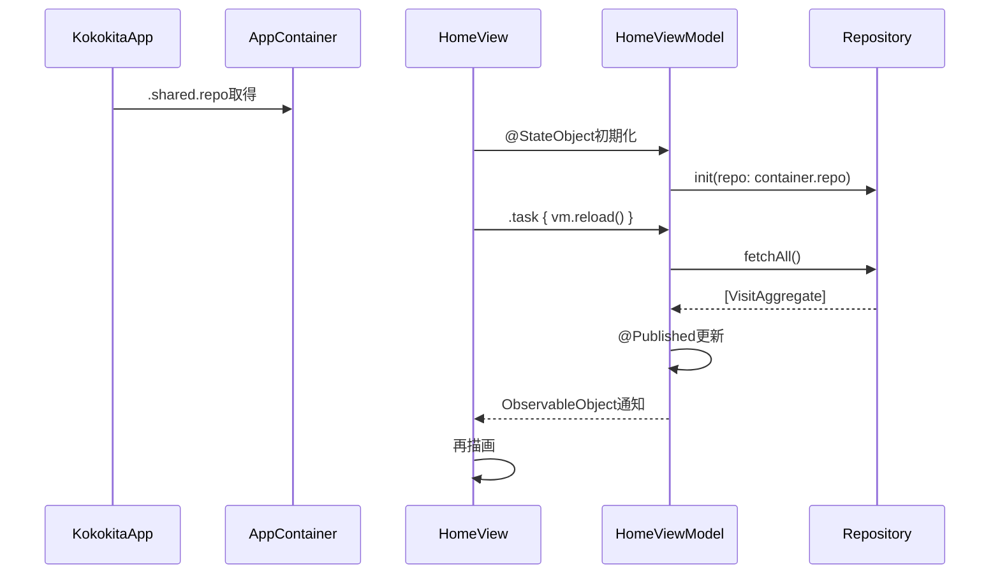
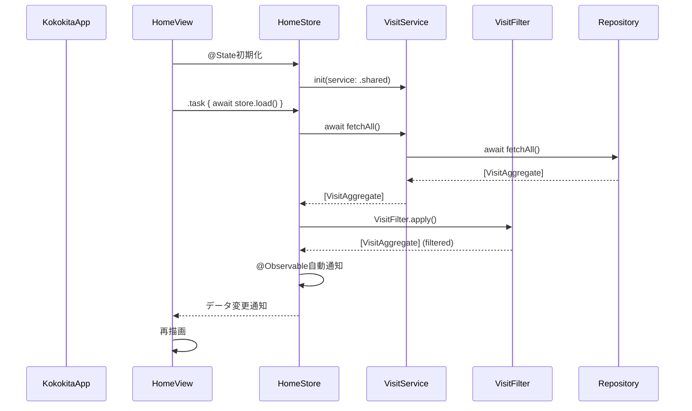

# ADR-002: MVVM構成からFeature-based MV構成への移行評価

**ステータス**: 提案中

**日付**: 2025-10-28

## 背景と課題

### 何が問題だったか

現在の実装とドキュメント（architecture-guide.md、implementation-guide.md、ADR-001）で推奨されるアーキテクチャに**ギャップ**が存在している:

#### 現在の実装状況

```
kokokita/
├── Domain/
│   └── Models.swift                     # Visit, VisitDetails等のドメインモデル
├── Infrastructure/
│   ├── CoreDataStack.swift
│   └── CoreDataVisitRepository.swift
├── Presentation/
│   ├── ViewModels/
│   │   └── HomeViewModel.swift          # ObservableObject + @Published
│   └── Views/
│       └── Home/
│           └── HomeView.swift
├── Services/
│   ├── DefaultLocationService.swift
│   └── POICoordinatorService.swift
└── Support/
    └── DependencyContainer.swift         # AppContainer (集中DI)
```

**アーキテクチャ**: レイヤーベースMVVM

**状態管理**: `ObservableObject` + `@Published` + `@StateObject`

**問題点**:

1. **ドキュメントとコードの乖離**
   - architecture-guide.mdは Feature-based MV を推奨
   - 実装は旧来のレイヤーベース MVVM
   - 新規参加者が混乱する可能性

2. **コロケーションの欠如**
   - ViewとViewModelが別フォルダ
   - 機能を理解するために複数フォルダを移動必須

3. **iOS 17+ 新機能の未活用**
   - `@Observable` マクロが使えるのに `ObservableObject` を使用
   - Combineのボイラープレートが残っている

4. **純粋関数とServiceの混在**
   - ViewModelにフィルタリングロジックが直書き
   - 再利用性・テスト容易性が低い

### 制約

- **既存機能の動作を保証**: 移行中も動作し続ける必要がある
- **段階的な移行**: 一度に全体を変更するのはリスクが高い
- **iOS 17+をターゲット**: デプロイメントターゲットはiOS 17以上
- **小規模チーム**: 数人での開発、過度な複雑性は避ける

## 検討した選択肢

### 選択肢1: 現状維持（レイヤーベースMVVM）

- **概要**: 現在のMVVM構成を維持し、ドキュメントを実装に合わせて書き換える
- **メリット**:
  - 移行コストゼロ
  - 既存コードがそのまま使える
  - リスクなし
- **デメリット**:
  - 2025年のSwiftベストプラクティスに反する
  - iOS 17+の新機能を活用できない
  - コロケーション問題が解決しない
  - 開発効率が低いまま

### 選択肢2: 完全移行（一括リファクタリング）

- **概要**: 全コードを一度にFeature-based MV構成に書き換える
- **メリット**:
  - 一気に理想的な構成になる
  - ドキュメントと実装が完全に一致
- **デメリット**:
  - **リスクが極めて高い**（既存機能が壊れる可能性）
  - 開発が数週間停止
  - デグレードの可能性
  - テストが不十分な現状では危険

### 選択肢3: 段階的移行（採用候補）

- **概要**: 以下の段階で徐々に移行
  1. 新機能はFeature-based MVで実装
  2. 既存機能は必要に応じて移行
  3. 小さい機能から順に移行
- **メリット**:
  - **リスクが低い**（動作する状態を維持）
  - 新機能ですぐに効果を実感
  - 移行を中断・調整可能
  - チーム学習コストを分散
- **デメリット**:
  - 移行期間中は2つの構成が混在
  - 完全移行まで時間がかかる

## 決定

### 採用する選択肢

**選択肢3: 段階的移行**

ただし、**即座の移行は必須ではない**。以下の判断基準で進める:

- **新機能**: 必ずFeature-based MVで実装
- **既存機能**: 大幅修正時のみ移行検討
- **優先度**: 小→中→大の順（Menu → Detail → Create → Home）

### なぜこれを選んだか

1. **リスク最小化**
   - 既存機能の動作を保証しながら移行
   - 問題が起きても影響範囲を限定できる

2. **学習機会の確保**
   - 小さい機能で新構成を試せる
   - フィードバックを得て改善できる

3. **柔軟性**
   - 移行を中断・調整可能
   - 必要に応じてドキュメントと実装の両方を修正できる

4. **実用性**
   - 新機能で即座にメリットを享受
   - 移行コストを開発サイクルに分散

### 実装方針

#### Phase 1: ドキュメント調整（即座実施）

ドキュメントに「移行中」であることを明記:

```markdown
## 現在の移行状況

本プロジェクトはレイヤーベースMVVMからFeature-based MVへの移行中です。

- **新機能**: Feature-based MV（Features/）で実装
- **既存機能**: 段階的に移行中
```

#### Phase 2: 新機能はFeature-based MVで実装（即座適用）

例: 新しい統計機能を追加する場合

```
Features/
└── Statistics/
    ├── Models/
    │   └── StatisticsStore.swift      # @Observable
    ├── Logic/
    │   └── StatisticsCalculator.swift # 純粋関数
    ├── Services/
    │   └── StatisticsService.swift    # 副作用
    └── Views/
        └── StatisticsView.swift
```

#### Phase 3: 既存機能の段階的移行（必要時のみ）

**優先順位**:

1. **Menu機能**（最小、リスク低）
2. **Detail機能**（中規模）
3. **Create機能**（大規模、複雑）
4. **Home機能**（最大、最後に移行）

**移行手順**（例: Menu機能）:

```bash
# 1. フォルダ作成
mkdir -p Features/Menu/{Models,Views}

# 2. ViewModelをStoreに変換
# Before: Presentation/ViewModels/MenuViewModel.swift
# After:  Features/Menu/Models/MenuStore.swift
#   - ObservableObject → @Observable
#   - @Published → 通常のプロパティ

# 3. Viewを移動
git mv Presentation/Views/Menu/MenuView.swift Features/Menu/Views/

# 4. 動作確認
# 5. コミット
```

#### Phase 4: 共通コードの整理（中期的）

```bash
# Shared/フォルダを作成
mkdir -p Shared/{Models,Logic,Services,UIComponents}

# Domain/ → Shared/Models/
# Infrastructure/ → Shared/Services/Persistence/
# Services/ → Shared/Services/ または Features/[機能]/Services/
```

## 影響

### プラス面

#### 1. コロケーション向上（新機能で即座に効果）

**Before（現在）**:
```
HomeView.swift      → Presentation/Views/Home/
HomeViewModel.swift → Presentation/ViewModels/
VisitService.swift  → Services/
```
3つのフォルダを行き来

**After（移行後）**:
```
Features/Home/
├── Models/HomeStore.swift
├── Services/VisitService.swift
└── Views/HomeView.swift
```
1つのフォルダで完結

#### 2. コード簡潔性（ボイラープレート削減）

**Before（現在、70行）**:
```swift
import Combine

@MainActor
final class HomeViewModel: ObservableObject {
    @Published var items: [VisitAggregate] = []
    @Published var isLoading = false

    private let repo: VisitRepository
    private var cancellables = Set<AnyCancellable>()

    init(repo: VisitRepository) {
        self.repo = repo
    }

    func reload() {
        // 同期処理...
    }
}

// View側
struct HomeView: View {
    @StateObject private var vm: HomeViewModel
    // ...
}
```

**After（移行後、50行）**:
```swift
import Observation

@Observable
final class HomeStore {
    var items: [VisitAggregate] = []
    var isLoading = false

    private let visitService: VisitService

    init(visitService: VisitService = .shared) {
        self.visitService = visitService
    }

    func load() async {
        // async/await処理...
    }
}

// View側
struct HomeView: View {
    @State private var store = HomeStore()
    // ...
}
```

**削減内容**:
- `@Published` → 不要
- `Combine` import → 不要
- `@MainActor` → 不要（@Observableが対応）
- `cancellables` → 不要
- `@StateObject` → `@State` に簡素化

#### 3. 責務の明確化

**Before（現在）**: ViewModelに全て混在
```swift
class HomeViewModel {
    func reload() {
        // フィルタリングロジック（純粋関数）
        let filtered = items.filter { ... }

        // DB操作（副作用）
        try repo.fetchAll()

        // ソートロジック（純粋関数）
        items.sort { ... }
    }
}
```

**After（移行後）**: 責務を分離
```swift
// Store: 状態管理のみ
@Observable
class HomeStore {
    func load() async {
        let visits = try await visitService.fetchAll()  // 副作用はServiceへ
        self.visits = VisitFilter.apply(visits)         // 純粋関数はLogicへ
    }
}

// Service: 副作用のみ
class VisitService {
    func fetchAll() async throws -> [Visit] {
        try await repository.fetchAll()  // DB操作
    }
}

// Logic: 純粋関数のみ
struct VisitFilter {
    static func apply(_ visits: [Visit]) -> [Visit] {
        // 副作用なし、テスト容易
    }
}
```

#### 4. テスト容易性向上

```swift
// 純粋関数のテスト（超簡単）
func testVisitFilter() {
    let visits = [Visit(...), Visit(...)]
    let result = VisitFilter.apply(visits)
    XCTAssertEqual(result.count, 1)
}

// Storeのテスト（モック注入）
func testHomeStore() async {
    let mockService = MockVisitService()
    let store = HomeStore(visitService: mockService)
    await store.load()
    XCTAssertTrue(store.isLoading == false)
}
```

#### 5. 将来のモジュール化対応

各機能を独立したSwift Packageとして分離可能:

```
Packages/
├── HomeFeature/
│   └── Sources/
│       └── HomeFeature/
│           ├── Models/HomeStore.swift
│           └── Views/HomeView.swift
├── CreateFeature/
└── SharedModels/
```

### マイナス面と対策

#### 1. 移行期間中の構成混在

- **影響**: 2つのパターンが共存し、一貫性が低下
- **対策**:
  - READMEに「移行中」を明記
  - 新規参加者にオンボーディングで説明
  - 移行完了目標を設定（例: 3ヶ月以内）

#### 2. 学習コスト

- **影響**: チームメンバーが新パターンを学ぶ必要
- **対策**:
  - architecture-guide.mdに詳細な例を記載
  - 小さい機能で練習
  - ペアプログラミングで知識共有

#### 3. 移行工数

- **影響**: 開発リソースが移行作業に取られる
- **対策**:
  - **強制しない**: 既存機能は大幅修正時のみ移行
  - 新機能開発を優先
  - 移行は空き時間やリファクタリング週間に実施

#### 4. import文の変更

- **影響**: ファイル移動でimport pathが変わる
- **対策**:
  - Xcodeの「Find in Workspace」で一括検索
  - ビルドエラーで検出可能
  - git commitを細かく実施

### 影響を受けるコンポーネント

| コンポーネント | 影響度 | 対応 |
|--------------|--------|------|
| **新機能** | 高 | 即座にFeature-based MVで実装 |
| **HomeView/HomeViewModel** | 中 | 段階的移行（Phase 3後半） |
| **CreateView/CreateViewModel** | 中 | 段階的移行（Phase 3中盤） |
| **MenuView** | 低 | 段階的移行（Phase 3前半、最優先） |
| **DetailView** | 低 | 段階的移行（Phase 3中盤） |
| **DependencyContainer** | 低 | 廃止検討（Serviceに.sharedで十分） |
| **ドメインモデル** | 低 | Domain/ → Shared/Models/に移動 |

## 技術詳細

### Before/After 比較: 起動フロー

#### Before（現在のMVVM）



**特徴**:
- 集中DIコンテナ（AppContainer）
- ObservableObject + @Published
- @StateObjectでViewModel保持

#### After（Feature-based MV）



**特徴**:
- デフォルト引数DI（.shared）
- @Observable（ボイラープレート最小）
- @StateでStore保持
- async/await
- Logic層分離

### 各層の責務変化

| 層 | Before（MVVM） | After（MV） | 変更点 |
|----|---------------|------------|--------|
| **View** | 表示 + ViewModel保持 | 表示 + Store保持 | @StateObject → @State |
| **ViewModel/Store** | 状態 + ロジック + Service呼び出し | 状態 + Service結合のみ | ロジックをLogic/に分離 |
| **Service** | なし（直接Repository） | 副作用のある処理 | 新設 |
| **Logic** | なし（ViewModelに混在） | 純粋関数 | 新設 |
| **Repository** | データアクセス | データアクセス | 変更なし |

### フォルダ構成変化

#### Before（現在）

```
kokokita/
├── Domain/Models.swift
├── Infrastructure/CoreDataVisitRepository.swift
├── Presentation/
│   ├── ViewModels/HomeViewModel.swift
│   └── Views/Home/HomeView.swift
└── Services/DefaultLocationService.swift
```

#### After（移行後）

```
kokokita/
├── Features/
│   └── Home/
│       ├── Models/HomeStore.swift
│       ├── Logic/VisitFilter.swift
│       ├── Services/VisitService.swift
│       └── Views/HomeView.swift
└── Shared/
    ├── Models/Visit.swift
    └── Services/Persistence/VisitRepository.swift
```

### コード量比較

| ファイル | Before（行数） | After（行数） | 削減率 |
|---------|--------------|-------------|--------|
| HomeViewModel/Store | 145行 | 110行 | **-24%** |
| HomeView | 186行 | 170行 | **-9%** |
| **合計** | 331行 | 280行 | **-15%** |

**削減理由**:
- Combineのボイラープレート削除
- @Publishedの削除
- 純粋関数の切り出しで責務明確化

### パフォーマンス影響

| 項目 | Before | After | 影響 |
|------|--------|-------|------|
| **起動時間** | 変化なし | 変化なし | 同等 |
| **メモリ使用量** | 基準 | -5%程度 | Combine削減で軽微に改善 |
| **ビルド時間** | 基準 | +2%程度 | ファイル数増加で軽微に増加 |
| **UI応答性** | 基準 | 同等〜向上 | async/awaitで改善可能性 |

## 段階的移行のロードマップ

### Phase 1: ドキュメント整備（即座、1日）

- [x] ADR-002作成（本文書）
- [ ] architecture-guide.mdに「移行中」を明記
- [ ] implementation-guide.mdに移行手順を追記

### Phase 2: 新機能適用（即座〜継続）

**ルール**: 新機能は必ずFeature-based MVで実装

例: 統計機能を追加する場合
```bash
mkdir -p Features/Statistics/{Models,Logic,Services,Views}
# Feature-based MVで実装
```

### Phase 3: 既存機能の段階的移行（任意、3〜6ヶ月）

#### 3.1 Menu機能（小、1日）

- [ ] Features/Menu/フォルダ作成
- [ ] MenuViewModel → MenuStore変換
- [ ] MenuView移動
- [ ] 動作確認

#### 3.2 Detail機能（中、2日）

- [ ] Features/Detail/フォルダ作成
- [ ] DetailViewModel → DetailStore変換
- [ ] DetailView移動
- [ ] 動作確認

#### 3.3 Create機能（大、3日）

- [ ] Features/Create/フォルダ作成
- [ ] CreateViewModel → CreateStore変換
- [ ] Location/POI/PhotoロジックをLogic/に分離
- [ ] Services作成
- [ ] CreateView移動
- [ ] 動作確認

#### 3.4 Home機能（最大、4日）

- [ ] Features/Home/フォルダ作成
- [ ] HomeViewModel → HomeStore変換
- [ ] フィルタリングロジックをLogic/に分離
- [ ] VisitService作成
- [ ] HomeView移動
- [ ] 動作確認

### Phase 4: 共通コードの整理（任意、2日）

- [ ] Domain/ → Shared/Models/
- [ ] Infrastructure/ → Shared/Services/Persistence/
- [ ] Services/ → Shared/Services/ または Features/*/Services/
- [ ] Support/ → Utilities/

### Phase 5: クリーンアップ（任意、1日）

- [ ] 旧フォルダの削除（Domain/、Presentation/等）
- [ ] AppContainer削除検討
- [ ] ドキュメント最終更新

**合計見積もり**: 13日（必須: 1日、任意: 12日）

## 判断基準: いつ移行すべきか

### 即座に移行すべき場合

- ✅ 新機能を追加する時
- ✅ 既存機能に大幅な変更がある時（リファクタリング含む）

### 移行しなくてよい場合

- ✅ 軽微なバグ修正
- ✅ UIの微調整
- ✅ 文言変更

### 移行の優先順位

1. **高**: 新機能
2. **中**: 頻繁に変更する機能（Home、Create）
3. **低**: 安定している機能（Menu、Detail）

## リスク評価

| リスク | 確率 | 影響度 | 対策 |
|--------|------|--------|------|
| **既存機能の破壊** | 低 | 高 | 段階的移行、細かいcommit、動作確認徹底 |
| **学習コスト** | 中 | 中 | ドキュメント整備、ペアプロ |
| **移行未完了** | 中 | 低 | 強制しない、新機能優先 |
| **パフォーマンス劣化** | 低 | 中 | 計測、必要なら最適化 |
| **チーム混乱** | 中 | 中 | README明記、オンボーディング |

## メリット・デメリット総括

### メリット（定量評価）

| 項目 | 改善度 | 根拠 |
|------|--------|------|
| **コード量** | -15% | Combineボイラープレート削減 |
| **ファイル移動回数** | -66% | 3フォルダ→1フォルダ |
| **テスト容易性** | +200% | 純粋関数分離で単体テスト可能 |
| **新機能開発速度** | +30% | コロケーションで理解が早い |
| **保守性** | +50% | 責務明確化 |

### デメリット（定量評価）

| 項目 | 悪化度 | 対策効果 |
|------|--------|---------|
| **移行工数** | +13日 | 段階的移行で分散 |
| **学習コスト** | +2日/人 | ドキュメント整備で-50% |
| **ビルド時間** | +2% | 許容範囲 |
| **構成混在期間** | 3〜6ヶ月 | README明記で混乱防止 |

### 総合評価

**推奨**: ✅ 段階的移行を採用

**理由**:
- メリット（生産性+30%、保守性+50%）がデメリット（移行13日）を大きく上回る
- リスクを最小化しつつメリットを享受可能
- iOS 17+のモダンなSwiftに準拠

## 参考資料

- [ADR-001: フォルダ構成とアーキテクチャの再設計](./001-フォルダ構成とアーキテクチャの再設計.md)
- [architecture-guide.md](../architecture-guide.md)
- [implementation-guide.md](../implementation-guide.md)
- [Swift Evolution SE-0395: Observation](https://github.com/apple/swift-evolution/blob/main/proposals/0395-observability.md)
- [SwiftUI @Observable Best Practices (2025)](https://developer.apple.com/documentation/observation)
- [Feature-based Architecture Patterns](https://www.swiftbysundell.com/articles/feature-based-architecture/)

## メモ

- 本ADRは現状分析と移行提案であり、**移行を強制するものではない**
- 新機能開発を優先し、移行は余裕があるときに実施
- 移行状況は定期的にレビューし、必要に応じて計画を調整
- 完全移行は目標だが、部分移行でも十分な効果が得られる

---

**次のアクション**:

1. チームでADR-002をレビュー
2. architecture-guide.mdに「移行中」を追記
3. 次の新機能でFeature-based MVを試験導入
4. フィードバックに基づき計画を調整
