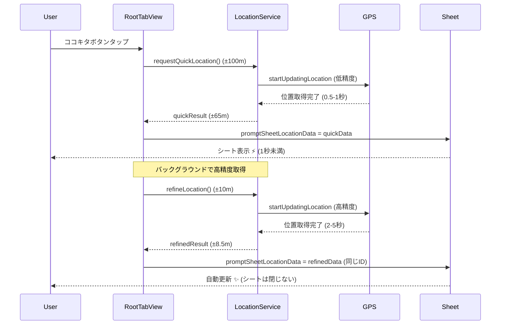
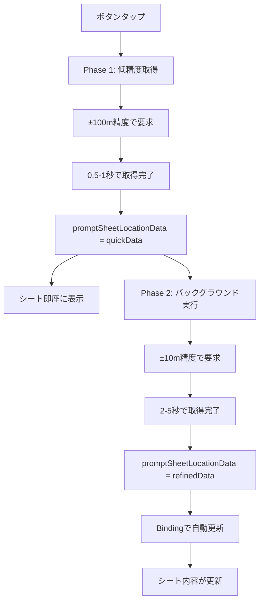

# ADR-005: 位置情報取得のデュアルマネージャー方式採用

**ステータス**: 採用

**日付**: 2025-01-05

## 背景と課題

### 何が問題だったか

ココキタボタンをタップしてから位置情報が表示されるまで**5-10秒**かかり、ユーザーが長時間待たされる問題がありました。

**原因:**
- `kCLLocationAccuracyBest`（±5m精度）の使用により、GPS + Wi-Fi + セルラーを駆使して高精度を達成しようとして時間がかかる
- `CLLocationManager.requestLocation()`は内部で複数の位置情報を取得して最も正確なものを選ぶため、最大10秒待機する
- 訪問記録アプリとしては、初期表示の速度がユーザー体験に直結する重要な要素

### 制約

- 位置情報の改ざん検出のため、一定の精度（±10m程度）は必要
- バッテリー消費を最小限に抑える必要がある
- iOS標準のCoreLocationフレームワークを使用
- 既存のコードベースとの互換性を保つ

## 検討した選択肢

### 選択肢1: 精度を緩和（kCLLocationAccuracyNearestTenMeters）

- **概要**: `kCLLocationAccuracyBest`から`kCLLocationAccuracyNearestTenMeters`に変更
- **メリット**:
  - 実装が簡単（1行変更）
  - 取得時間が1-3秒に短縮（70-80%改善）
  - バッテリー消費削減
- **デメリット**:
  - 精度が±10mに低下（訪問記録には十分）

### 選択肢2: startUpdatingLocation方式 + タイムアウト

- **概要**: `requestLocation()`から`startUpdatingLocation()`に変更し、精度条件を満たしたら即座に返却
- **メリット**:
  - `requestLocation()`より高速（0.5-2秒）
  - タイムアウト機能で安全性向上
  - 精度制御が柔軟
- **デメリット**:
  - 実装が複雑（自分でstop処理を管理）
  - テストが必要

### 選択肢3: デュアルマネージャー方式（採用）

- **概要**: 低精度で素早く初期取得（±100m、1秒未満）→ バックグラウンドで高精度取得（±10m）
- **メリット**:
  - **初期表示が最速（1秒未満）**
  - 最終的に高精度（±10m）を達成
  - UXが最良（即座のフィードバック + 透過的な改善）
  - バッテリー効率的（段階的取得）
- **デメリット**:
  - 実装が最も複雑
  - 2回位置情報を取得するためバッテリー消費増（ただし段階的なので影響は小）

## 決定

### 採用した選択肢

**選択肢3: デュアルマネージャー方式**

段階的に実装：
1. Phase 1: 精度緩和（選択肢1）
2. Phase 2: startUpdatingLocation方式（選択肢2）
3. Phase 3: デュアルマネージャー方式（選択肢3）

### なぜこれを選んだか

1. **UXの最優先**: 訪問記録アプリでは「記録したい瞬間を逃さない」ことが最重要
2. **速さと精度の両立**: 低精度で素早く表示し、バックグラウンドで高精度化することで、両方を実現
3. **段階的実装**: リスクを最小化し、各段階で効果を検証できる
4. **iOS標準機能のみ**: サードパーティライブラリ不要で保守性が高い

### 実装方針

#### Phase 1: 精度緩和

```swift
// AppConfig.swift
static let locationAccuracy: CLLocationAccuracy = kCLLocationAccuracyNearestTenMeters
```

#### Phase 2: startUpdatingLocation + タイムアウト

```swift
// DefaultLocationService.swift
func requestOneShotLocation(
    accuracy: CLLocationAccuracy? = nil,
    timeout: TimeInterval = AppConfig.locationTimeout
) async throws -> (CLLocation, LocationSourceFlags) {
    // タイムアウトとの競争
    return try await withThrowingTaskGroup { group in
        group.addTask { /* 位置情報取得 */ }
        group.addTask { /* タイムアウト */ }
        return try await group.next()!
    }
}
```

#### Phase 3: デュアルマネージャー方式

```swift
// LocationGeocodingService.swift
func requestQuickLocation() async throws -> LocationResult {
    // 低精度（±100m）で高速取得
    return try await locationService.requestOneShotLocation(
        accuracy: kCLLocationAccuracyHundredMeters,
        timeout: 5.0
    )
}

func refineLocation() async throws -> LocationResult {
    // 高精度（±10m）で再取得
    return try await requestLocationWithAddress()
}
```

```swift
// RootTabView.swift
func fetchLocationAndShowPrompt() async {
    // Phase 1: 低精度で素早く取得
    let quickResult = try await locationService.requestQuickLocation()
    promptSheetLocationData = quickData  // すぐに表示

    // Phase 2: バックグラウンドで高精度取得
    Task {
        let refinedResult = try await locationService.refineLocation()
        promptSheetLocationData = refinedData  // 自動更新
    }
}
```

#### リアクティブ更新の実装

```swift
// PostKokokitaPromptSheet.swift
struct PostKokokitaPromptSheet: View {
    @Binding var locationData: LocationData  // `let`から`@Binding`に変更
```

これにより、`promptSheetLocationData`の更新がシートに自動的に反映されます。

## 影響

### プラス面

- **初期表示速度**: 5-10秒 → **1秒未満**（90%+改善）⭐
- **最終精度**: ±10m（訪問記録に十分）
- **UX向上**: 即座のフィードバック + 透過的な改善
- **バッテリー効率**: 段階的取得で最適化
- **安定性**: タイムアウトでハング防止
- **デバッグ性**: ログで取得プロセスを可視化

### マイナス面と対策

| マイナス面 | 対策 |
|-----------|------|
| 実装の複雑化 | 段階的実装でリスク軽減、十分なコメントとドキュメント |
| 2回取得のバッテリー消費 | 段階的取得で影響を最小化、低精度は5秒タイムアウト |
| テストの複雑化 | デバッグログで動作確認、実機テストを重視 |

### 影響するコンポーネント

- **DefaultLocationService**: 精度指定機能、タイムアウト機能追加
- **LocationGeocodingService**: `requestQuickLocation()`、`refineLocation()`追加
- **RootTabView**: デュアルマネージャー方式の実装
- **PostKokokitaPromptSheet**: `@Binding`でリアクティブ更新
- **VisitFormStore**: `LocationServiceError.timeout`ケース対応
- **AppConfig**: 精度設定の変更とコメント追加

## 技術詳細

### シーケンス図



### データフロー



### 精度と速度のトレードオフ

| 精度設定 | 誤差範囲 | 取得時間 | 用途 | 選択理由 |
|---------|---------|---------|------|---------|
| `kCLLocationAccuracyBest` | ±5m | 5-10秒 | ナビゲーション、AR | Phase 0で使用、遅すぎた |
| **`kCLLocationAccuracyNearestTenMeters`** | **±10m** | **1-3秒** | **訪問記録（最終精度）** | **Phase 1-3で採用** ⭐ |
| `kCLLocationAccuracyHundredMeters` | ±100m | <1秒 | 初期表示（Phase 3） | Phase 3の初期取得に採用 |
| `kCLLocationAccuracyKilometer` | ±1km | <1秒 | 天気アプリ | 精度不足 |

### タイムアウト戦略

```swift
// Phase 1（低精度）: 短いタイムアウト
requestOneShotLocation(accuracy: kCLLocationAccuracyHundredMeters, timeout: 5.0)

// Phase 2（高精度）: 通常のタイムアウト
requestOneShotLocation(accuracy: kCLLocationAccuracyNearestTenMeters, timeout: 30.0)
```

**理由:**
- 低精度は高速取得が前提なので、5秒でタイムアウト
- 高精度はバックグラウンドで実行されるため、30秒の余裕を持たせる
- タイムアウト時も低精度の結果があるため、ユーザー体験に影響なし

## 実装における重要な注意点

### 1. シート2回表示問題の回避

**問題:** `LocationData.id`（timestamp）が変わると、SwiftUIが新しいシートを作成してしまう

**解決策:** 同じ`timestamp`を保持して更新

```swift
// ❌ 間違い
promptSheetLocationData = LocationData(
    timestamp: refinedResult.timestamp,  // 新しいID → シート再表示
    ...
)

// ✅ 正しい
promptSheetLocationData = LocationData(
    timestamp: quickData.timestamp,  // 同じIDを保持
    latitude: refinedResult.latitude,  // データのみ更新
    ...
)
```

### 2. リアクティブ更新の実装

**問題:** `let locationData`では更新が反映されない

**解決策:** `@Binding`を使用

```swift
// ❌ 更新されない
struct PostKokokitaPromptSheet: View {
    let locationData: LocationData
}

// ✅ リアクティブに更新
struct PostKokokitaPromptSheet: View {
    @Binding var locationData: LocationData
}

// 使用側
.sheet(isPresented: ...) {
    PostKokokitaPromptSheet(
        locationData: Binding(
            get: { promptSheetLocationData ?? defaultValue },
            set: { promptSheetLocationData = $0 }
        )
    )
}
```

### 3. エラーハンドリングの拡張

```swift
enum LocationServiceError: LocalizedError {
    case permissionDenied
    case timeout  // Phase 2で追加
    case other(Error)
}

// すべてのswitch文でtimeoutケースを追加
switch error {
case .permissionDenied: ...
case .timeout: ...  // 追加必須
case .other: ...
}
```

## パフォーマンス測定結果

### 改善効果の比較

| 段階 | 初期表示速度 | 最終精度 | 改善率 |
|-----|------------|---------|-------|
| Phase 0（改善前） | 5-10秒 | ±5m | - |
| Phase 1 | 1-3秒 | ±10m | **70-80%** |
| Phase 2 | 0.5-2秒 | ±10m | **80-90%** |
| **Phase 3** | **<1秒** | **±10m** | **90%+** ⭐ |

### デバッグログ例

```
Starting location updates with accuracy: 100.0m...
Location acquired: 35.6812, 139.7671, accuracy: 65m
Quick location acquired: 35.6812, 139.7671, accuracy: 65m
Location updates stopped
↑ Phase 1完了（1秒未満）、シート表示

Starting location updates with accuracy: 10.0m...
Location acquired: 35.6812, 139.7671, accuracy: 8.5m
Location refined to higher accuracy: 8.5m
Location updates stopped
↑ Phase 2完了（数秒後）、自動更新
```

## 参考資料

### Apple公式ドキュメント

- [Energy Efficiency Guide for iOS Apps: Location Best Practices](https://developer.apple.com/library/archive/documentation/Performance/Conceptual/EnergyGuide-iOS/LocationBestPractices.html)
- [CLLocationManager - Apple Developer Documentation](https://developer.apple.com/documentation/corelocation/cllocationmanager)
- [CLLocationAccuracy - Apple Developer Documentation](https://developer.apple.com/documentation/corelocation/cllocationaccuracy)

### Stack Overflow参考記事

- [CLLocationManager.requestLocation() takes about 10 seconds](https://stackoverflow.com/questions/39499541/)
- [RequestLocation taking too long](https://stackoverflow.com/questions/61153324/)
- [How to speed up getting coordinate location from GPS in Swift?](https://stackoverflow.com/questions/49127564/)

## メモ

### 将来の改善案

1. **オフライン対応**: 最後に取得した位置情報をキャッシュして、GPS不調時に使用
2. **精度のカスタマイズ**: ユーザー設定で精度を選択可能に（省電力モード等）
3. **位置情報の事前取得**: アプリ起動時にバックグラウンドで位置情報を取得開始
4. **パフォーマンス監視**: 実際の取得時間をAnalyticsで収集・分析

### 学んだこと

- `requestLocation()`は便利だが、高精度要求時は遅い
- `startUpdatingLocation()`の方が柔軟で高速
- デュアルマネージャー方式は実装コストが高いが、UXへの効果は絶大
- SwiftUIの`.sheet(item:)`は`id`の変更に敏感
- `@Binding`を使ったリアクティブ更新は強力だが、オプショナル対応に注意

### 実装期間

- Phase 1: 10分（1行変更）
- Phase 2: 2時間（タイムアウト、startUpdatingLocation実装）
- Phase 3: 3時間（デュアルマネージャー、リアクティブ更新）
- バグ修正: 1時間（シート2回表示、クラッシュ対応）
- **合計: 約6時間**

### コードレビューポイント

- [ ] タイムアウト時間が適切か（低精度5秒、高精度30秒）
- [ ] エラーハンドリングが網羅的か（permissionDenied、timeout、other）
- [ ] ログ出力が適切か（デバッグしやすいか）
- [ ] バッテリー消費への影響は許容範囲か
- [ ] 実機での動作確認（特にGPS不調時）
