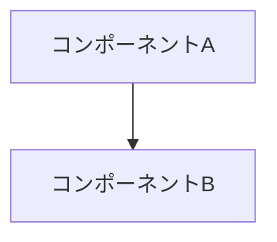

# ADR-NNN: [タイトル]

**ステータス**: 採用 / 却下 / 置き換え

**日付**: YYYY-MM-DD

> **ヒント**: このテンプレートは全部埋める必要はありません。重要なのは「なぜその決定をしたか」が残ることです。

## 背景と課題

### 何が問題だったか
[この決定が必要になった背景や課題]

### 制約
[あれば記載]

## 検討した選択肢

### 選択肢1: [名前]

- **概要**: [説明]
- **メリット**: [メリット]
- **デメリット**: [デメリット]

### 選択肢2: [名前]

- **概要**: [説明]
- **メリット**: [メリット]
- **デメリット**: [デメリット]

## 決定

### 採用した選択肢
[選択肢X]

### なぜこれを選んだか
[決定理由を簡潔に]

### 実装方針
[具体的にどう実装するか]

## 影響

### プラス面
- [良い影響]

### マイナス面と対策
- [悪い影響]: [対策]

### 影響するコンポーネント
- [コンポーネント名]: [影響内容]

## 技術詳細（必要なら）

### 図（必要なら）

## 参考資料

- [関連資料やリンク]

## メモ

[その他の補足情報]
