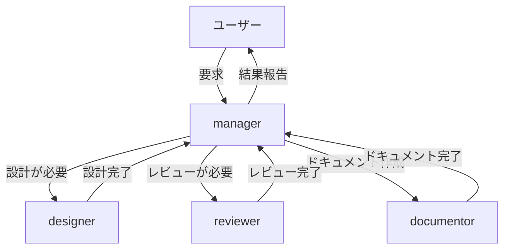
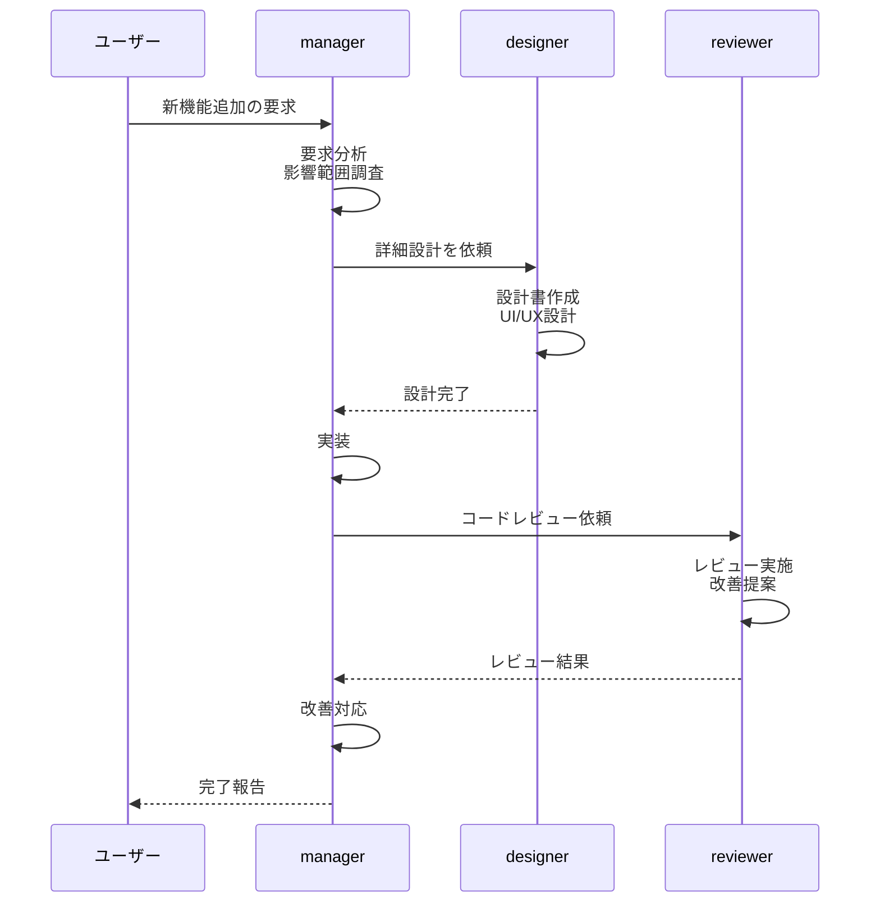

# エージェント連携ガイド

## 概要

kokokitaプロジェクトでは、複数の専門エージェントが連携してタスクを遂行します。このドキュメントでは、エージェント間の連携方法とそれぞれの役割を説明します。

## エージェントの種類

### manager（実装済み）

**役割**: プロジェクト全体の統括管理

**責務**:
- ユーザーからの要求を理解し、タスクに分割
- 技術的観点とサービスデザイン観点からの判断
- 実装方針とベストプラクティスの遵守確認
- 他のエージェントへのタスク委譲
- ドキュメント管理の統括

**使用方法**:
```
/manager [要求内容]
```

**参照するドキュメント**:
- `CLAUDE.md`: プロジェクト概要
- `doc/architecture-guide.md`: ベストプラクティス
- `doc/implementation-guide.md`: 実装ガイド

### designer（今後実装予定）

**役割**: 詳細設計の作成

**責務**:
- 新機能や大きな変更の詳細設計
- UI/UXの設計
- データモデルの設計
- コンポーネント構成の設計
- 設計書の作成と更新

**呼び出しタイミング**:
- 新しい画面や大きな機能の追加
- 複数のコンポーネントにまたがる変更
- データモデルの大きな変更
- 外部サービスとの統合

### reviewer（今後実装予定）

**役割**: コードレビューと品質チェック

**責務**:
- 実装コードのレビュー
- ベストプラクティスへの準拠確認
- UIとロジックの分離確認
- パフォーマンスとセキュリティのチェック
- 改善提案

**呼び出しタイミング**:
- 重要な機能の実装完了後
- リファクタリング完了後
- プルリクエスト前

### documentor（今後実装予定）

**役割**: ドキュメント作成の専門家

**責務**:
- ADRの作成
- 設計書の詳細化
- 技術ドキュメントの執筆
- ドキュメントの整合性確認

**呼び出しタイミング**:
- 重要な技術的決定を記録する必要がある
- 複雑な設計を文書化する必要がある
- 既存ドキュメントの大幅な更新

## エージェント間の連携フロー

### 基本的な流れ



### 具体例: 新機能追加



## エージェントの呼び出し方

### managerから他のエージェントを呼び出す

managerエージェントは、SlashCommandツールまたはTaskツールを使用して他のエージェントを呼び出します。

**SlashCommandを使う場合**（今後実装）:
```markdown
設計が必要なので、designerエージェントを呼び出します。

[SlashCommandツール使用]
/designer [タスク内容]
```

**Taskツールを使う場合**:
```markdown
レビューが必要なので、専門エージェントに依頼します。

[Taskツール使用]
subagent_type: "reviewer"  # または実装されたエージェント名
prompt: "以下のコードをレビューしてください: [詳細]"
```

## エージェント設計の原則

### 責務の分離

各エージェントは明確な責務を持ち、他のエージェントの領域には踏み込みません:

- **manager**: 全体管理と調整
- **designer**: 設計に特化
- **reviewer**: レビューに特化
- **documentor**: ドキュメント作成に特化

### コンテキスト管理

各エージェントは独立したコンテキストを持ちます:

- タスク開始時に必要な情報を渡す
- タスク完了時に結果を返す
- 中間状態はエージェント内で管理

### ドキュメント参照

すべてのエージェントが共通のドキュメントを参照します:

- `CLAUDE.md`: プロジェクト全体の方針
- `doc/architecture-guide.md`: コーディング規約
- `doc/implementation-guide.md`: 実装手順
- `doc/ADR/`: 技術的決定
- `doc/design/`: 設計書

## 今後の拡張

### 追加予定のエージェント

- **tester**: テストコード作成とテスト実行
- **optimizer**: パフォーマンス最適化
- **security**: セキュリティチェックと脆弱性診断
- **analyzer**: コード分析とリファクタリング提案

### エージェント追加の手順

1. `.claude/commands/[エージェント名].md`を作成
2. エージェントの役割と責務を明確に定義
3. 参照するドキュメントを指定
4. managerから呼び出せるように統合
5. このガイドに追加

## ベストプラクティス

### managerエージェント使用時

- 要求を明確に伝える
- 期待する成果物を指定する
- 制約条件があれば伝える

### エージェント間連携

- 必要な情報は最初に全て渡す
- タスクを適切な粒度に分割する
- 結果を明確に返す

### ドキュメント同期

- エージェントが作成・更新したドキュメントは常に最新に保つ
- ドキュメント間の整合性を確認する
- 古い情報は削除または更新する
