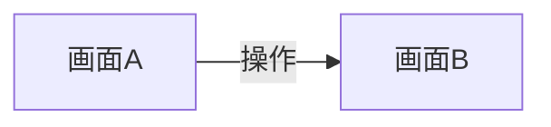
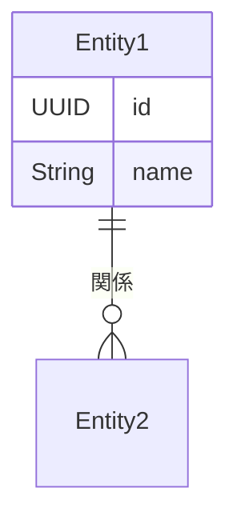
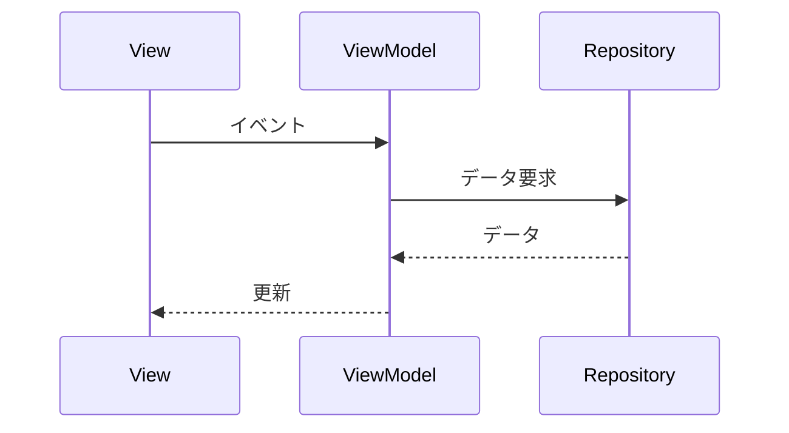
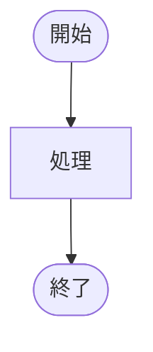

# [機能名]

> **ヒント**: このテンプレートは全部埋める必要はありません。必要な部分だけ使ってください。

## 概要

### 目的
[この機能を実装する目的]

### 対象ユーザー
[この機能を使うユーザー]

## 要件

### やりたいこと
- [要件1]
- [要件2]

### 制約
- [制約があれば]

## UI設計

### 画面構成（必要なら）

```
簡単なスケッチや説明
```

### 画面遷移（必要なら）



## データ設計

### モデル（必要なら）



### データの流れ（必要なら）



## 技術設計

### ファイル構成

```
どのファイルを作るか、または変更するか
```

### 主要なクラス・構造体

```swift
// 疑似コードでOK
class ViewModel {
    func doSomething() {
        // 処理の流れ
    }
}
```

### 処理の流れ（複雑な場合）



## 実装メモ

### ポイント
- [実装時に気をつけること]

### 参考
- [参考にしたコードやドキュメント]

## 残タスク・TODO

- [ ] [やること1]
- [ ] [やること2]

## 変更履歴（必要なら）

- YYYY-MM-DD: [変更内容]
